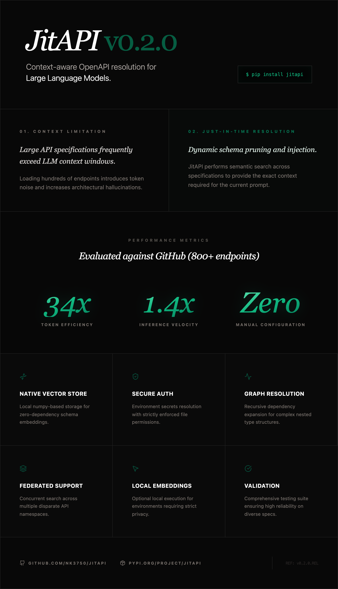

# JitAPI

[](https://pypi.org/project/jitapi/)
[](https://pepy.tech/project/jitapi)
[](https://opensource.org/licenses/MIT)
[](https://www.python.org/downloads/)

**Point Claude at any API. JitAPI figures out which endpoints to call and in what order — automatically.**

<!-- mcp-name: io.github.nk3750/jitapi -->

JitAPI is an MCP server that lets Claude interact with *any* API from its OpenAPI spec. Instead of dumping hundreds of endpoints into context, JitAPI uses semantic search and a dependency graph to surface only what's needed — then Claude plans and executes the calls.

https://github.com/user-attachments/assets/53f72f89-a41a-4a9c-a688-ec876ea05fbd

<p align="center">
  
</p>

---

## The Problem

Stripe has 300+ endpoints. GitHub has 800+. Loading the full spec into Claude's context wastes tokens and causes hallucinations. Writing a custom MCP server for every API you use doesn't scale.

**JitAPI solves this:** register any OpenAPI spec once, then ask for what you need in plain English. It finds the right endpoints, resolves dependencies between them, and lets Claude execute the calls.

## Quick Start

```bash
pip install jitapi
```

Add to your Claude Code config (`.mcp.json`):

```json
{
  "mcpServers": {
    "jitapi": {
      "command": "uvx",
      "args": ["jitapi"]
    }
  }
}
```

That's it. No API keys required — JitAPI uses local embeddings out of the box.

Then in Claude:

```
You: Register the GitHub API from https://raw.githubusercontent.com/github/rest-api-description/main/descriptions/api.github.com/api.github.com.json

Claude: ✓ Registered GitHub v3 REST API — 1,107 endpoints indexed

You: List my repos

Claude: [searches for "list repositories for authenticated user" → finds GET /user/repos → executes]
Here are your repositories: ...
```

## Multi-API Orchestration

The killer feature: register multiple APIs and ask questions that span them. JitAPI searches across all registered APIs and Claude chains the calls.

```
You: Register the TMDB API and OpenWeatherMap API
Claude: ✓ Registered both APIs

You: Find the top popular movie on TMDB, then get the weather where it was filmed

Claude: [searches TMDB → GET /movie/popular → GET /movie/{id} for production locations
         → searches OpenWeather → GET /data/2.5/weather with the city]

The #1 popular movie is "Inception", filmed in Los Angeles.
Current weather in LA: 72°F, partly cloudy.
```

## How It Works

```
Register API                          Ask a question
     │                                      │
     ▼                                      ▼
Parse OpenAPI spec               Embed query → vector search
     │                                      │
     ▼                                      ▼
Build dependency graph           Find relevant endpoints
     │                                      │
     ▼                                      ▼
Embed all endpoints              Expand with dependencies
     │                                      │
     ▼                                      ▼
Store in vector DB               Return schemas → Claude executes
```

1. **Register** — Parse an OpenAPI spec, build a dependency graph (which endpoints need data from which other endpoints), and create searchable embeddings for all endpoints
2. **Search** — When you ask a question, JitAPI embeds your query and finds the most relevant endpoints via cosine similarity
3. **Expand** — The dependency graph adds any prerequisite endpoints (e.g., "you need to call GET /users first to get the user_id for POST /orders")
4. **Execute** — Claude gets the endpoint schemas and makes the API calls, passing data between steps

## MCP Tools

| Tool | Description |
|------|-------------|
| `register_api` | Register an API from an OpenAPI spec URL |
| `list_apis` | List all registered APIs and their endpoint counts |
| `search_endpoints` | Semantic search across endpoints using natural language |
| `get_workflow` | Find relevant endpoints with dependency resolution and full schemas |
| `get_endpoint_schema` | Get the complete schema for a specific endpoint |
| `call_api` | Execute a single API call with auth, path params, query params, and body |
| `set_api_auth` | Configure authentication (API key, bearer token, basic auth) |
| `delete_api` | Remove a registered API and all its data |

## Setup

### Claude Code

Create `.mcp.json` in your project directory (or `~/.claude.json` for global access):

```json
{
  "mcpServers": {
    "jitapi": {
      "command": "uvx",
      "args": ["jitapi"]
    }
  }
}
```

### Claude Desktop

Add to your Claude Desktop config:

| OS | Config path |
|----|-------------|
| macOS | `~/Library/Application Support/Claude/claude_desktop_config.json` |
| Windows | `%APPDATA%\Claude\claude_desktop_config.json` |
| Linux | `~/.config/Claude/claude_desktop_config.json` |

```json
{
  "mcpServers": {
    "jitapi": {
      "command": "uvx",
      "args": ["jitapi"]
    }
  }
}
```

### Embedding Providers

JitAPI works out of the box with **local embeddings** (fastembed) — no API keys needed. For better search quality on large APIs, you can add a cloud embedding provider:

| Provider | Quality | Setup |
|----------|---------|-------|
| **Local (default)** | Good | Nothing — works immediately |
| **Voyage AI** (recommended) | Excellent | `pip install jitapi[voyage]` + set `VOYAGE_API_KEY` |
| **OpenAI** | Excellent | `pip install jitapi[openai]` + set `OPENAI_API_KEY` |
| **Cohere** | Very good | `pip install jitapi[cohere]` + set `COHERE_API_KEY` |

Set the API key in your MCP config's `env` block:

```json
{
  "mcpServers": {
    "jitapi": {
      "command": "uvx",
      "args": ["jitapi"],
      "env": {
        "VOYAGE_API_KEY": "your-key-here"
      }
    }
  }
}
```

Provider is auto-detected from available environment variables. Priority: Voyage AI > OpenAI > Cohere > local.

### Authentication

Configure API authentication after registering. The recommended approach uses **environment variables** so secrets are never written to disk:

```json
{
  "mcpServers": {
    "jitapi": {
      "command": "uvx",
      "args": ["jitapi"],
      "env": {
        "GITHUB_TOKEN": "ghp_...",
        "OPENWEATHER_API_KEY": "your-key-here"
      }
    }
  }
}
```

Then tell Claude to use the env var:

```
You: Set bearer auth for GitHub using env var GITHUB_TOKEN
Claude: [calls set_api_auth with auth_type="bearer", env_var="GITHUB_TOKEN"]
✓ Auth configured for github (from env var $GITHUB_TOKEN)
```

With `env_var`, JitAPI reads the secret from the environment at request time — only the env var *name* is persisted, never the credential itself.

You can also pass credentials directly (they'll be stored in `~/.jitapi/auth.json` with `0600` permissions):

```
You: Set API key auth for OpenWeather with param name "appid"
Claude: [calls set_api_auth with auth_type="api_key_query", credential="...", param_name="appid"]
✓ Auth configured for openweather
```

Supported auth types: `bearer`, `api_key_header`, `api_key_query`, `basic`.

> **Security note:** When using `env_var`, credentials are resolved at runtime and never touch the filesystem. When passing `credential` directly, secrets are stored as plaintext JSON at `~/.jitapi/auth.json` (file permissions `0600`, directory `0700`). For production use, prefer the `env_var` approach.

## Environment Variables

| Variable | Required | Description |
|----------|----------|-------------|
| `VOYAGE_API_KEY` | No | Voyage AI API key (recommended cloud provider) |
| `OPENAI_API_KEY` | No | OpenAI API key (alternative cloud provider) |
| `COHERE_API_KEY` | No | Cohere API key (alternative cloud provider) |
| `JITAPI_STORAGE_DIR` | No | Data directory (default: `~/.jitapi`) |
| `JITAPI_LOG_LEVEL` | No | DEBUG, INFO, WARNING, ERROR (default: INFO) |

## Development

```bash
git clone https://github.com/nk3750/jitapi.git
cd jitapi
pip install -e ".[dev]"
pytest
ruff check src/
```

## License

MIT
